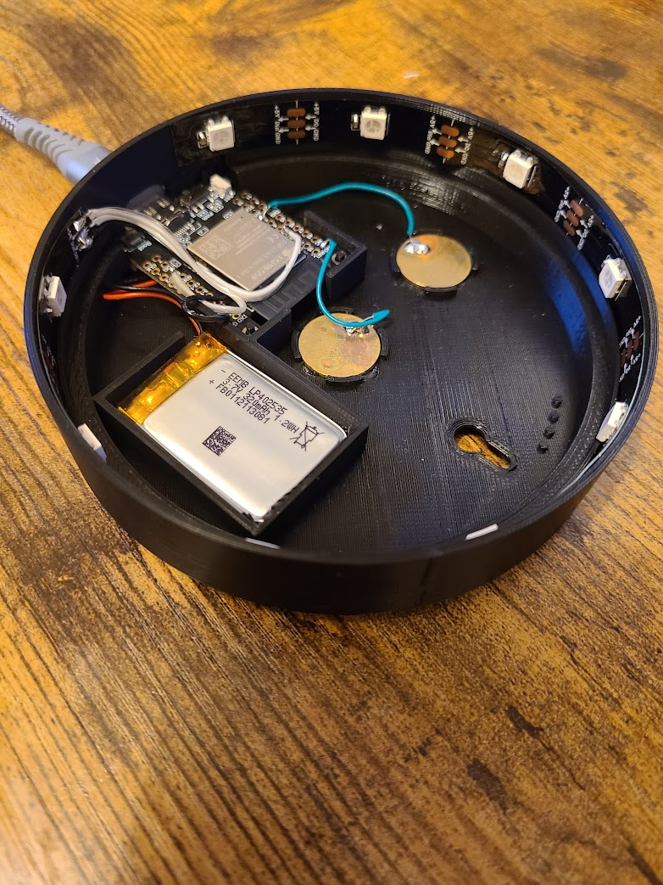

# Building Your Own Glowing Pucks

It's not too hard to build your own Glowing Pucks.  There's very little electronic assembly: only 5 wires to be soldered.  No small-pitch stuff.

The Puck shell needs to be 3D printed.  Other than that, the hardware assembly is trivial.

Software install shouldn't be too tricky for anyone who has done any Arduino programming, though you'll need to get a (free) account at HiveMQ to support the MQTT traffic.  Other MQTT brokers would probably work as well.



## Materials

You'll need to procure a handful of electronic and hardware items to build this project.

### Electronic Components

- LilyGo ESP32 [T7-S3 Development Board](https://www.lilygo.cc/products/t7-s3) - the brains behind the device
- 9 [WS2812-B LEDs](https://www.aliexpress.com/item/2036819167.html) in 30/meter spacing - these are embedded in the shell and illuminate the epoxy coaster from the side
- 2 16mm [brass stamping blanks](https://www.aliexpress.com/item/32716955260.html) - the touch "buttons" that turn the device on
- 320mah [402535 LiPo Battery](https://www.amazon.co.uk/dp/B08HD1N273) - **WARNING: The 1.2mm connector needs polarity reversal**
- 3-wire [ribbon cable](https://www.amazon.co.uk/dp/B09R42ZGQD) - to connect the microcontroller to the LED strip
- 2 26-gauge [solid-core wires](https://www.amazon.co.uk/sourcing-map-Electrical-High-Temperature-Manipulator/dp/B0C6FDQ6K9) - to connect the brass discs to the microcontroller
- [USB-C Cable](https://www.amazon.co.uk/dp/B0BPH67J4X) - for charging the device

### Hardware Components

- 3D-printed Coaster [lid](Collateral/Case-top.stl) and [base](Collateral/Case-bottom.stl).  (SCAD source: [lid](Collateral/Case-top.scad), [base](Collateral/Case-bottom.scad))
- 10cm diam x 1cm deep Epoxy Coaster - I love [these](https://www.etsy.com/uk/listing/1048533995/purple-floral-handmade-resin-coasters?variation0=2108656922), but any clear coaster with these dimensions should do
- 10cm diameter background [background](Collateral/Puck-Background.png) ([svg](Collateral/Puck-Background.svg))
- 4 stick-on [rubber feet](https://www.amazon.co.uk/gp/product/B08QHZ1SW4)

### Software Components

- [Wedding-Puck.ino](Wedding-Puck.ino) Arduino sketch
- Several Arduino Libraries
  - [Adafruit NeoPixel](https://github.com/adafruit/Adafruit_NeoPixel) - to drive the LEDs
  - WiFiClientSecure (built-in) - for interacting with MQTT broker
  - [PubSubClient](https://github.com/knolleary/pubsubclient) - for interacting with MQTT broker
  - [ESPAsyncWebServer](https://github.com/me-no-dev/ESPAsyncWebServer) - for WiFi Training mode
  - [AsyncTCP](https://github.com/dvarrel/AsyncTCP) - for WiFi Training mode
  - [ArduinoJson](https://github.com/bblanchon/ArduinoJson) - for saving WiFi credentials

## Assembling the Electronics

1. **Cut LED strip**.  Cut 9 LEDs from the WS2812B strip.  At 30/meter spacing, this gives just about the right number to surround the 10cm diameter coaster.

1. **Solder LED Strip**.  Cut and strip about 6cm of the ribbon cable.  Solder one end of the ribbon cable to the 3 inputs om the LED strip and the other end to the LilyGo T7-S3 as follows:

    - **LED GND** <--> **T7 GND**
    - **LED +5V** <--> **T7 +5V**
    - **LED Din** <--> **T7 pin 18**

1. **Solder Brass Discs**. Cut and strip about 3-4cm of the solid-core wire.  Solder one end of each wire to a brass disc.  You'll have to apply the iron for a long time to get the discs hot enough to properly bond with the solder.  Be careful!  Don't burn yourself on the hot disc!  Solder one wire to T7 GND and the other to the T7 touch pin 5.

    - **Centre Brass Disc** <--> **T7 GND**
    - **Edge Brass Disc** <----> **T7 pin 5**

1. **Hook up battery**.  Insert the battery into the T7 connectoor.  **NOTE**: If you buy the variant of the [402535 LiPo battery](https://www.amazon.co.uk/dp/B08HD1N273) that I sourced on [Amazon](https://www.amazon.co.uk/dp/B08HD1N273), it is the **WRONG POLARITY**.  You'll need to make an easy [polarity adjustment](https://youtu.be/za-azgbZor8?si=B9gw-FfFPbaVmNWF) before you use it with the T7-S3.  Make **sure** the battery's red wire matches up with the **+** terminal on the T7.

## Assembling the Hardware

1. **Print Case**.  Print the [top](Collateral/Case-top.stl) and [bottom](Collateral/Case-bottom.stl) coaster shells.  I've had good luck with black PLA, but I imagine any material would do.

1. **Mount Circuitry**. Snap the T7 and the battery into their respective compartments in the shell base.

1. **Mount LED strip**. Insert the LED strip into its grooved slot around the perimeter of the base, with the LEDs facing inward.  No need to remove the adhesive on the back of the strip: it's not going anywhere.  The epoxy coaster and the assembly will keep it firmly in place.

1. **Glue Discs**. Apply a bit of super glue - I find the gel variant works great - around the rim of the round compartments on the bottom, and glue the brass discs into place.

1. **Create Backdrop**.  Cut a 10cm circle from a bit of black paper or cardstock to use as a backdrop.  You'll insert it into the shell base, underneath the epoxy coaster.  Optionally, draw a design in gold or coloured pen that can be seen through the transparent bits.  (I created a [design](Collateral/Puck-Background.png) in Inkscape that I printed on a 5x7" photo printer.  This worked rather well.)


1. **Install Software and Test**. Before you permanently glue down the electronics, now would be a good time to install the software components and test the hardware, in case you need to do any rework.

1. **Hot Glue Components**.  Apply just enough glue to hold the T7 and battery firmly in place.  Hot glue works great here.  Put some on the brass discs, too, to help stabilize them.

1. **Insert Backdrop and Coaster**. Insert the backdrop and the epoxy coaster into the assembly.  If the coaster is not perfectly round, you may have to use a small screwdriver to pry it into place.

1. **Finish Assembly**. Press the shell lid down onto the assembly.  It's tapered to have a reasonably nice press fit, but you might consider applying a dab of hot glue here.

1. **Attach Feet**.  Affix four evenly-spaced rubber feet to the base.

## Software Installation

1. Get a free [Hive MQ](https://www.hivemq.com/company/get-hivemq/) account.  We'll use their MQTT brokerage service to post and read "Glow" messages from Pucks.  Hive has a nice free level that supports up to 100 devices.

1. Create a new MQTT broker **Cluster** in your Hive MQ account.  Write down the server URL and the user credentials for your Cluster: you'll need to insert these into the sketch shortly.

1. Install **Arduino**, the **ESP32 plug-in**, and the required libraries:

    - [Adafruit NeoPixel](https://github.com/adafruit/Adafruit_NeoPixel)
    - WiFiClientSecure (built-in)
    - [PubSubClient](https://github.com/knolleary/pubsubclient)
    - [ESPAsyncWebServer](https://github.com/me-no-dev/ESPAsyncWebServer)
    - [AsyncTCP](https://github.com/dvarrel/AsyncTCP)
    - [ArduinoJson](https://github.com/bblanchon/ArduinoJson)

1. Open the [Wedding-Coaster.ino](Wedding-Coaster.ino) sketch and configure it with these settings for the LilyGo T7.
    - Board = **ESP32S3 Dev Module**
    - PSRAM = **OPI**
    - Flash Mode = **QIO 80MHz**
    - Flash Size = **16MB**
    - USB Mode = **Hardware CDC and JTAG**
    - USB CDC On Boot = **Enabled**
    - Partition Scheme = **Minimal SPIFFS (1.9MB APP with OTA/190KB SPIFFS)**.

1. At the top of the [Wedding-Coaster.ino](Wedding-Coaster.ino) sketch, customize the strings as appropriate to your configuration:

    - Enter the **MQTT server and login credentials** for your Hive MQTT broker.
    - Set **default WiFi Credentials** if you want to use the Puck's auto-provisioning feature (optional).
    - Customize the **WiFi Training** strings, displayed when the Puck goes into WiFi training mode (optional).
    - Set wedding **anniversary** information if you want to do the special Anniversary Glow (optional).

The code you'll need to edit is this bit:

```C++
        // Hive MQ credentials for MQTT broker
        #define mqttServer "xxxxxxxxxxxxxxxxxxxxxxxxxxxxxxxx.xx.xx.hivemq.cloud"
        #define mqttUser ".........."
        #define mqttPass ".........."

        // Optional Auto-provisioning customization
        #define DEFAULT_WIFI_SSID ".........."
        #define DEFAULT_WIFI_PASS ".........."
        #define DEFAULT_WIFI_OWNER "........."

        // WiFi Training strings (customize here)
        #define WIFI_HOST_NAME "Wedding-Puck"
        #define ACK_MESSAGE "<p>Your input has been received. Thank you.</p>"
        #define ACK_PAGE_TITLE "The Wedding Puck"

        // Optional Anniversary celebration info
        // #define WEDDING_DAY 14
        // #define WEDDING_MONTH 10
        // #define WEDDING_YEAR 2023
```

Finally, install and run [Wedding-Coaster.ino](Wedding-Coaster.ino) on each coaster.

## General Testing

1. Once the sketch has been successfully installed, the first test is to touch the brass discs.  The LEDs should dimly light in an orange-ish glow that indicates the Puck is trying to connect.  If you don't see any light, check the wiring to the LED strip and to the brass discs. Examine the debug output in the Serial console.  Because WiFi is not yet configured, the LEDs should eventually pulse purple and fade to black.
1. Try an externally-triggered 'Glow'.  On a phone with a 2.4GHz WiFi Hotspot feature, create a Hotspot called **wedding-fireworks**.  Within a minute or so, the Puck should start Glowing until the Hotspot expires or is disabled.
1. Configure WiFi via either WiFi Training or Auto-provisioning. (See below.)
1. Now that WiFi is available, test a locally-triggered 'Glow' by touching the brass discs. If WiFi has been correctly set up, this should initiate a five-minute light show.  If you get a short purple pulsing instead, it means the WiFi connection failed - probably because the credentials were not properly configured.  Red pulsing means things are working properly, but you attempted a second Glow too quickly.
1. Verify that a quick second Glow attempt does indeed trigger the red pulsing error indication.
1. If you have built more than one Puck, verify that 'Glowing' one triggers the others.  If it doesn't work, make sure they have all been correctly connected to WiFi.

## WiFi Training Testing

Once the Pucks have been distributed to your guests, they need to be connected to WiFi. The new owners do this by putting the Puck through **WiFi Training Mode**. Test this before distributing! Detailed instructions can be found [here](WiFi-Training.md), but here's the basic idea:

1. Press the brass discs for 6 seconds until the Puck pulses blue.  The Puck stays in WiFi Training mode for up to 5 minutes.
1. Verify on your cell phone/tablet that WiFi Hotspot **Wedding-Puck** is available.  Connect to it.
1. Point your phone's browser to the WiFi configuration page at <http://192.168.4.1>.  This should bring up a form where you can enter your credentials.  Verify that the page looks right.  (You can customize its look in your sketch.)
1. Verify that once you "submit" your credentials, the Puck operates properly.  It should now Glow when triggered by another WiFi-connected Puck or when you touch the brass discs.
1. Once you are satisfied, you can erase your own WiFi credentials from the Puck's storage by **deprovisioning**.  (See below.)

## Auto-Provision/Deprovision Testing

If you have set **DEFAULT_WIFI_SSID** and **DEFAULT_WIFI_PASS** in your sketch, you can use a feature called "auto-provisioning" to temporarily set your own WiFi credentials on the Puck.  Initially, Pucks can't log into WiFi, because no credentials are yet stored in the local flash.  But, for testing purposes, you can temporarily store the DEFAULT values you've entered using one of these two techniques:

1. Create 2.4GHz Hotspot **wedding-provision** on a phone or tablet. This should provision default WiFi credentials for *all* active Pucks within range of the phone within 90 seconds. Each Puck will glow green when it's been provisioned.  OR,
2. Press and hold a Puck's brass discs for about 20 seconds... until it glows green.  This provisions a single puck.

Provisioning saves you the hassle of having to perform WiFi Training on each puck when you're testing.

Once you are satisfied everything is working, you can erase all saved credentials from storage by *deprovisioning*.  Create a 2.4GHz Hotspot **wedding-deprovision** and leave it active for a couple of minutes.

## Hotspot commands

To review, here are the secret puck commands you can issue by setting up a 2.4GHz Hotspot on your phone.  Note that the ESP32 processor is only capable of 2.4GHz band WiFi, so certain iPhones, which default to 5GHz, may not work without changing some settings.

- **wedding-fireworks** ----> do the wedding dinner glow
- **wedding-provision** ----> provision all pucks with the default SSID/pass
- **wedding-deprovision** --> erase all WiFi credentials from all pucks

## T7-S3 Wiring

Wiring for this project is simple.  Here's a reminder chart.

| Conn A      | Conn B               |
| ----------- | -------------------- |
| T7 GND      | Centre Brass Disc    |
| T7 GPIO5    | Edge Brass Disc      |
| T7 GND      | LED Strip GND        |
| T7 GPIO18   | LED Strip Din        |
| T7 5V       | LED Strip 5V         |

## Strategy

The Puck spends most of its time asleep, waking every minute or when its brass discs are touched.  When it wakes, it does two things:

1. It tries to connect to the local WiFi (if credentials have been configured) to check whether any new messages have been published on the MQTT broker's */devices/glow* topic.  If there is a new message, the device performs a 5-minute Glow. If it was awakened by a touch, it *publishes* an MQTT notification to alert the other Pucks before performing the Glow.
1. Next, it scans the available WiFi SSIDs to see if any special "Hotspot commands" (see above) have been issued.  If the **wedding-fireworks** SSID is seen, it performs a 1-minute Glow repeatedly for as long as the SSID is present.

## Detailed Algorithm

At wake-up, the device follows this algorithm:

- If voltage is too low, then flash red and go back to sleep.
- If wake is from touch, do the orange/brown "I'm thinking" pattern.
  - If touch lasts >6 seconds, transition to blue and do **WiFi Training**.
  - If touch lasts >20 seconds, transition to green and **auto-provision** default WiFi SSID/password.
- If it's the anniversary of the wedding, do a special 24-hour "Anniversary Animation".
- Try to connect to Wifi.
  - If successful, action depends on whether device has ever been "touched".
    - Touched?
      - If it's been > 23 hours since the last locally-initiated Glow, tell MQTT broker that we are triggering a new one!
      - If not, give the red 'error' signal.
    - Not touched?
      - Check MQTT broker for new messages.  If broker says that another Puck has recently initiated a Glow, do a 5-minute one in response.
  - If WiFi connection fails and the device was started by a touch, give the pulsing purple error signal to indicate that new WiFi credentials are likely needed.
- Look for special "Hotspot" SSID commands.
  - **wedding-fireworks** - do a Glow
  - **wedding-provision** - provision default WiFI SSID/password
  - **wedding-deprovision** - erase any WiFi credentials
- Fade to black
- Sleep for 60 seconds
- Repeat
