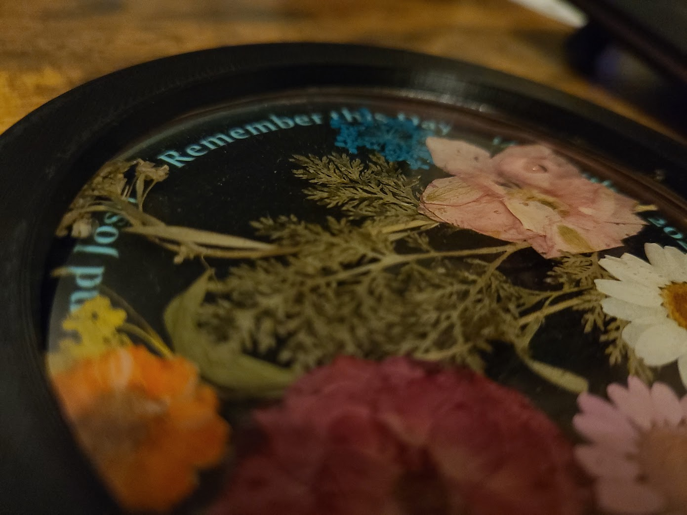
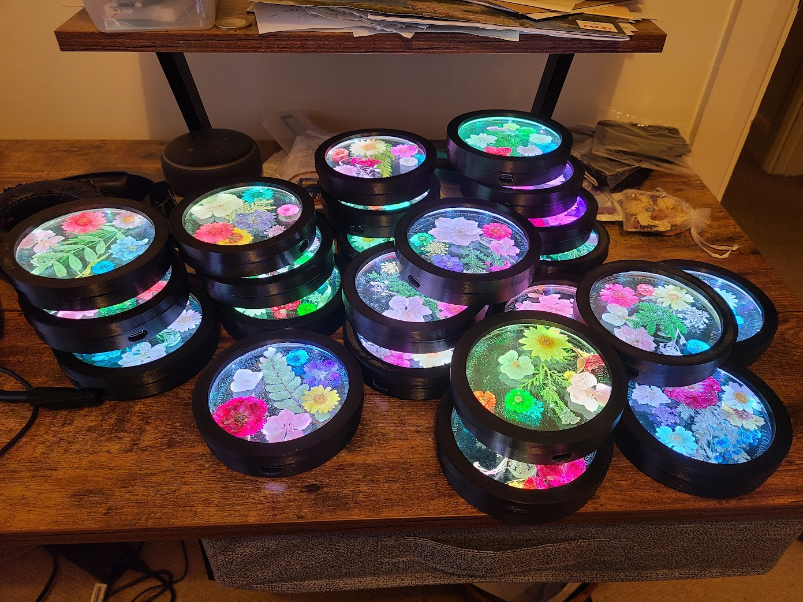

# The Glowing Wedding Puck

Glowing Pucks are small epoxy sculptures designed to decorate tables at a wedding/celebration dinner.  They are made of dried English wildflowers embedded in an epoxy 'coaster', encased in a 3D-printed shell.

## A Surprising Glow

At a predetermined 'significant moment' at the dinner (e.g. when bride and groom reappear), the pucks around the room mysteriously begin to glow: first one, then two, then eventually the whole room is illuminated with bright, colorful swirling light.

### The Meaning of the Glow

A speaker suddenly stands and explains to the astonished guests that the Glowing pucks are symbols of the love and support we all share for this beautiful couple on the threshold of their married life. The synchonized light-show we are witnessing is to be the first of many future 'Glows'... each reminding us how we once joyfully gathered in this lovely place and were very happy together.

### Taking the 'Glow' Home

As the dinner ends, the Glowing pucks go dark, and the speaker rises again to explain what is to happen next.  We are to take our pucks home, join them to our household WiFi, and place them somewhere they can be easily seen.

We learn that each of us will be able to recreate the wedding Glow by touching a pair of brass discs hidden on the underside.  A puck so activated sends a quiet invitation to its brother pucks around the world to join in a five-minute Glow. Every time one puck is touched, a global chorus of light is triggered.

It's a beautiful way to commemorate the wedding and keep its memory alive forever.  It's a way for each of us to say "I'm remembering you."

## Theory of Operation

### At the Dinner

The pucks are built to operate in two different modes.  As table ornaments at the celebration dinner, they are mostly asleep/inert, running off battery power and quietly awakening every minute or so to check whether it is time to Glow.

At the appropriate time, the speaker (or someone in the audience) quietly enables a special 2.4GHz "Hot Spot" on her smartphone.  This is the signal to begin.  When the pucks next wake from their periodic sleep and discover the new WiFi SSID **wedding-fireworks**, they know to begin the spectacular Glow.

The pucks Glow for as long as the special WiFi SSID is enabled.  Once it disappears, they resume their semi-dormant state.

### At Home

After the pucks have been distributed to their new homes, they must be connected to WiFi to sync with the Glow network.  By now they should be kept more or less always plugged in.

Teaching a puck its new home's WiFi credentials involves putting it into WiFi training mode and talking to it with a cell phone. Instructions can be found in the [WiFi Training](WiFi-Training.md) document.

## Build Guide

If you'd like to build your own Glow Pucks, consult the [Build Guide](Build-Guide.md).
