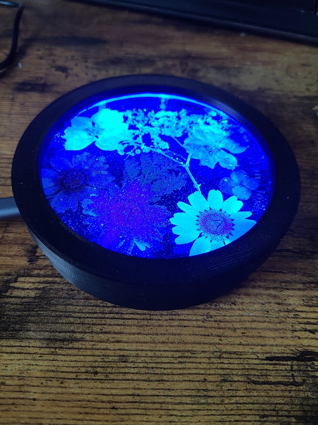
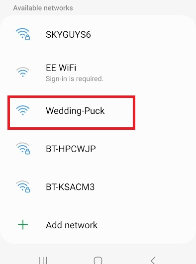
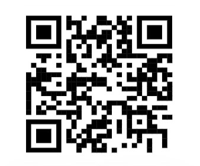
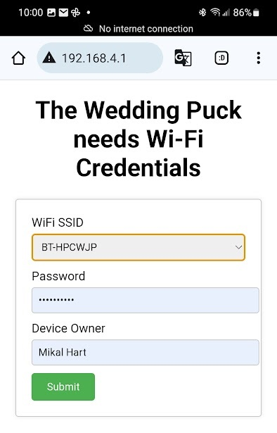

# Instructions for connecting the Puck to WiFi

To join the Glow network, each puck must connect to its new owner's WiFi. It's probably best to provide an instruction sheet with each puck when you hand them out explaining how this is done.

## WiFi Training

At home, plug your new puck in and teach it how to connect to your WiFi by putting it into **WiFi Training Mode**.

1. Gently press and hold the two brass discs for about six seconds.  Release when the puck begins to pulse blue.

1. On your phone or tablet, hunt for the newly-created WiFi network **Wedding-Puck**.  Connect to it.  (This network isn't connected to the internet, and on certain phones you may have to acknowledge that fact.)

1. In your phone's camera app, scan the QR code below, or simply open a browser and type <http://192.168.4.1> in the URL bar.

1. This brings up a page where you can enter your WiFi credentials. Fill in the page with your home WiFi name (SSID) and password and press **Submit**.  The puck will store this info to connect to your WiFi.

At this point, WiFi Training ends, and your puck is connected.  It may immediately begin a Celebration Glow in recognition that somgeone else has previously activated theirs.

Keep your puck plugged in.  Repeat steps 1-5 if you change location or WiFi credentials.

Whenever your puck is dark, you may choose to activate your own Glow by gently pressing the two brass discs.
